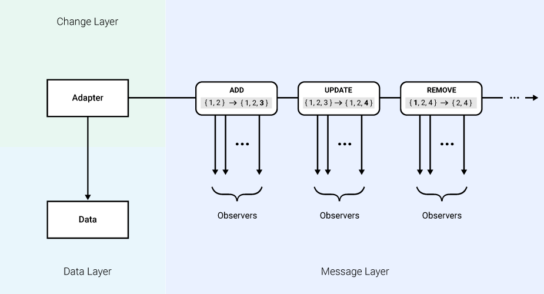

# RxChange-Kotlin - Reactive Change Model for Kotlin
RxChange-Kotlin is a library that implements the reactive change model for Kotlin. It was designed to simplify the code required to update application components (e.g. UI, database) based on changes in data, while maintaining consistency and reliability.

Under the hood, the library uses [RxJava](https://github.com/ReactiveX/RxJava) for publishing and subscribing to change events and [RxKotlin](https://github.com/ReactiveX/RxKotlin) for Kotlin specific extensions.

## Architecture



The architecture for the reactive change model consists of 3 main components:
- Data Layer
- Change Layer
- Message Layer

#### Data Layer

The data layer is where the underlying data is stored. This data will be accessed and modified throughout a program's lifespan.

It is important to note that the data cannot be modified directly with the reactive change model, as it must be done through the change layer.

#### Change Layer

The change layer is the layer in which the data is actually modified.  An adapter is used by the caller to either retrieve or modify the underlying data. For each successful change in the data, a change message will be emitted to interested observers.

The reactive change model supports both individual changes (e.g. adding a single element in a list) and batch changes (e.g. adding a multiple elements at a time).

#### Message Layer

The message layer is where the change messages are emitted. It is also the layer where the observers subscribe to and act upon these change events. Each change message contains snapshots of the data (both before and after the change), the type of change that occurred, and a snapshot of the change itself (e.g. the element that was added).

The reactive change model supports 3 types of data changes: add, remove, and update.

## Usage

### Dependencies

[](https://mvnrepository.com/artifact/com.umbraltech/rxchange-kotlin/1.2.0)

#### Gradle

```gradle
implementation 'com.umbraltech:rxchange-kotlin:x.y.z'
```

#### Maven

```xml
<dependency>
    <groupId>com.umbraltech</groupId>
    <artifactId>rxchange-kotlin</artifactId>
    <version>x.y.z</version>
</dependency>
```

### Built-In Adapters

The following adapters are packaged with the RxChange-Kotlin library. Information regarding supported operations can be seen in the table below.


| Adapter              | Corresponding Data    | Change Operations              
| :-----------:        | :-----------:         | -----------                     
| SingleChangeAdapter  | Any                   | update (data: D)                         
| ListChangeAdapter    | List                  | add (data: D) <br> addAll (data: List) <br> addAt (index: Int, data: D) <br><br> remove (data: D) <br> removeAll (data: List) <br> removeAt (index: Int) <br><br> update (index: Int, data: D)
| MapChangeAdapter     | Map                   | add (key: K, data: D) <br> addAll (entries: Map) <br><br> remove (key: K) <br> removeAll (keys: Set) <br><br> update (key: K, data: D) <br> updateAll (entries: Map)             
| SetChangeAdapter     | Set                   | add (data: D) <br> addAll (data: Set) <br><br> remove (data: D) <br> removeAll (data: Set)                 

### Change Events

In order to listen to change events, an observer must be registered with the adapter responsible for the data. The examples below include code for registering, filtering, and reading data from these change events.

To maintain simplicity, all the code samples will use a `ListChangeAdapter` with data of type `Int`.

#### Registering Observers

RxChange uses RxJava for listening to change events. The sample code below demonstrates how an observer can be registered with a change adapter.

```Kotlin
    listChangeAdapter.getObservable()
                .subscribe { changeMessage -> /* Logic */ }
```

#### Reading Data

The `ChangeMessage` class provides 4 properties:
- `oldPayload` - the data before the change
- `newPayload` - the data after the change
- `changeType` - the type of change that occurred with the data
- `changeSnapshot` - the element associated with the change

#### Applying Filters

RxChange-Kotlin comes with bundled with filters that can be used while registering observers, so that the code contained in the observers will only be triggered when certain conditions are met.

##### Change Type Filter

The `ChangeTypeFilter` class allows for listening to changes of a specific type. The example below registers an observer whose logic is only invoked when data is added to the adapter.

```Kotlin
    listChangeAdapter.getObservable()
                .filter(ChangeTypeFilter(ChangeType.ADD))
                .subscribe { changeMessage -> /* Logic */ }
```

#### Example

The following example combines all the segments listed above into a simple example that prints the values contained in each change message when data is added to the adapter:

Code:

```Kotlin
    val listChangeAdapter: ListChangeAdapter<Int> = ListChangeAdapter()

    listChangeAdapter.getObservable()
            .filter(ChangeTypeFilter(ChangeType.ADD))
            .subscribe { changeMessage ->
                println("Old List: ${changeMessage.oldData}")
                println("New List: ${changeMessage.newData}")
                println("Change: ${changeMessage.changeSnapshot}")
            }

    // Add the single integer to the dataset
    listChangeAdapter.add(1)

    // Add the list of integers to the dataset
    listChangeAdapter.addAll(listOf(2, 3, 4))
```

Output:

```
    Old List: []
    New List: [1]
    Change: [1]
    Old List: [1]
    New List: [1, 2, 3, 4]
    Change: [2, 3, 4]
```

## Additional Topics

### Lifecycle Awareness (Android)

When developing Android applications, it may be the case that observers need to be aware of an Activity or Fragment's lifecycle. We recommend using the [AutoDispose](https://uber.github.io/AutoDispose/) library to achieve this purpose.

## Documentation

- [KDoc](https://alec-desouza.github.io/RxChange-Kotlin/rxchange-kotlin/)

## See Also

- [RxChange-Java](https://github.com/Alec-DeSouza/RxChange-Java)
- [RxChange-Android-Demo (Java)](https://github.com/Alec-DeSouza/RxChange-Android-Demo/)